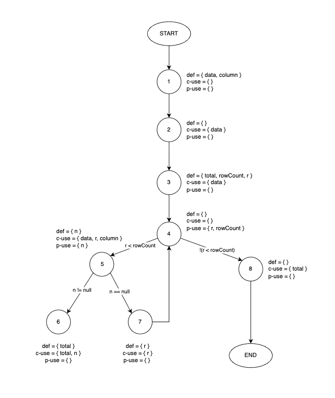
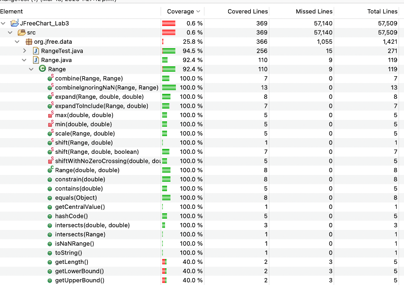
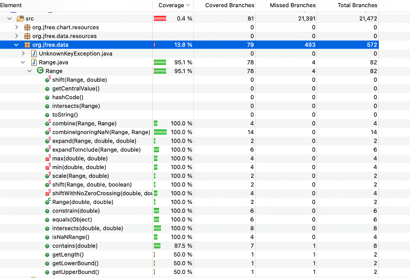
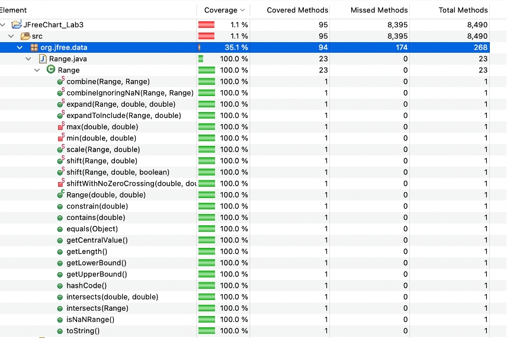
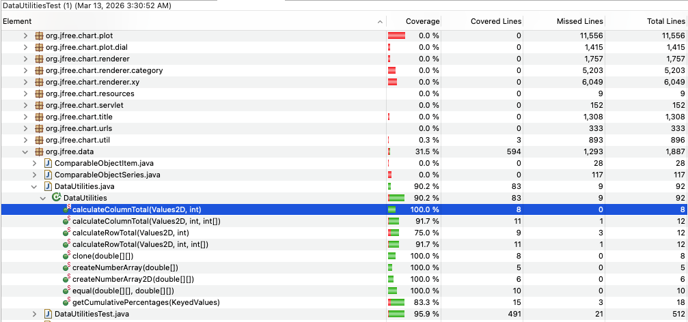
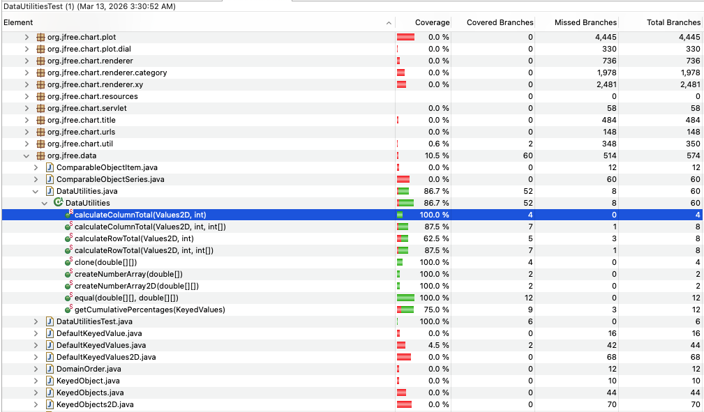
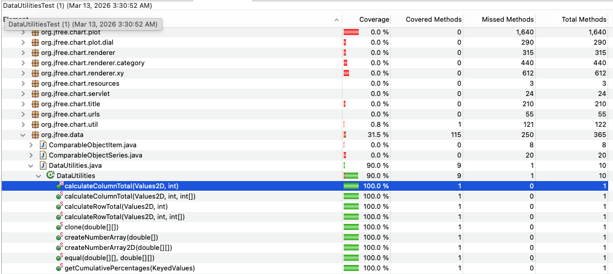

**SENG 637 - Dependability and Reliability of Software Systems**

**Lab. Report #3 – Code Coverage, Adequacy Criteria and Test Case Correlation**

| Group: 8              |
|-----------------------|
| Student 1 **Mark**    |   
| Student 2 **Zoe**     |   
| Student 3 **Heena**   |   
| Student 4 **Tafreed** | 

(Note that some labs require individual reports while others require one report
for each group. Please see each lab document for details.)

# 1 Introduction

The primary objective of this laboratory assignment is to explore the concepts of white-box testing and test adequacy through the application of code coverage metrics. While the previous assignment focused on requirements-based (black-box) testing, this phase shifts the focus toward the internal structure of the software to ensure that the test suite comprehensively exercises the source code.

By utilizing the JFreeChart framework as the System Under Test (SUT), this lab aims to bridge the gap between functional testing and structural analysis. The transition to white-box testing allows for a more granular assessment of the test suite's effectiveness by measuring exactly which statements, branches, and conditions are executed during test runs.

### 1.1 Scope and Objectives
The core goals of this activity include:

- **Metric Instrumentation**: Utilizing industry-standard tools (primarily EclEmma) to measure Statement, Branch, and Condition coverage.

- **Test Suite Enhancement**: Designing and implementing new JUnit test cases to meet specific coverage targets: 90% for Statement, 70% for Branch, and 60% for Condition coverage.

- **Data-Flow Analysis**: Performing manual calculations of Definition-Use (DU) pairs to gain a deeper theoretical understanding of how data moves through the logic of a program.

- **Tool Evaluation**: Critically assessing the integration, usability, and reporting capabilities of various Java-based coverage utilities within the Eclipse IDE.

### 1.2 Methodology
The team followed a structured approach beginning with the instrumentation of the original test suite developed in Assignment #2. Upon identifying coverage gaps, we employed a logic-driven strategy to craft new test inputs that force execution through previously unvisited code paths, such as exception handlers and complex conditional blocks. This process highlights the trade-offs between testing based purely on user requirements versus testing based on the "hidden" internal logic of the developer's implementation.

# 2 Manual Data-Flow Coverage Calculations

### Method 1: DataUtilities.calculateColumnTotal(Values2D data, int column) 
#### i. Data Flow Graph (DFG)

#### ii. Def-Use Sets Per Statement

| Statement     | def(s)                  | use(s)               |
| ------------- | ------------------------|--------------------- |
| 1             |  {data, column}         | None                 |
| 2             |  None                   | {data}               |
| 3             |  {total, rowCount, r}   | {data}               |
| 4             |  None                   | {r, rowCount}        |
| 5             |  {n}                    | {data, r, column, n} |
| 6             |  {total}                | {total, n}           |
| 7             |  {r}                    | {r}                  |
| 8             |  None                   | {total}              |

#### iii. DU-Pairs per Variable
| Variables     | **Def-Use pairs**                                 |
| ------------- | ------------------------------------------------- |
| data          | (1, 2), (1, 3), (1, 5)                            |
| column        | (1, 5)                                            |
| total         | (3, 6), (3, 8), (6, 6), (6, 8)                    |
| rowCount      | (3, 4)                                            |
| r             | (3, 4), (3, 5), (3, 7), (7, 4), (7, 5), (7, 7)    |
| n             | (5, 5), (5, 6)                                    |

#### iv. Test Cases Def-Use Pairs Covered

### Method 2: Range class' contains(double)

# 3 A detailed description of the testing strategy for the new unit test

Text…

# 4 A high level description of five selected test cases you have designed using coverage information, and how they have increased code coverage

1. **equals(Object)**: The test testEqualsObjectNotRange() verifies the behavior of the equals method when the compared object is not an instance of a Range. Here in this test, a Range object is compared with a String and the expected result is false. This test increases coverage by executing the branch in the equals method that confirms whether the object is an instance of Range. Without this test , the type checking branch can not be exercised.
2. **combineIgnoringNaN(Range, Range)**: The test testCombineIgnoringNaN_Range1Null() verifies the behaviour when the first range parameter is null and the method should return the second valid range. This test confirms that the input value is expected for null branch handling.The test increases coverage of conditional logic that validates method inputs.
3. **isNaNRange()**: The test testCombineIgnoringNaN_bothNaNBounds() creates two ranges where both upper and lower bound are NaN. When passed to combineIgnoringNaN the method internally calls isNaNRange() method to detect invalid ranges. This test ensures that the branch is executed where both ranges are considered NaN and increases coverage for both combineIgnoringNaN and the internal helper method is isNaNRange().
4. **shiftWithNoZeroCrossing(double, double)**: The test testShiftPositiveCrossZero() confirms that when shifting a positive range by a negative range delta that would normally cross zero. Since the zero crossing is disabled in this case, the value is clamped to zero. This test increases the branch coverage for conditional logic that restricts values from crossing zero when shifting ranges.
5. **expand(Range, double, double)**: The test testExpandBoundCross() evaluates the case where large negative margins cause calculated lower bound to exceed the upper bound. The implementation adjusts both bounds to midpoint when this occurs. This test improves coverage by executing the conditional branch that handles invalid expansion scenarios where the computed bounds cross.

# 5 A detailed report of the coverage achieved of each class and method (a screen shot from the code cover results in green and red color would suffice)

### **Range class:**

*Figure: Line Coverage*

*Figure: Branch Coverage*

*Figure: Method Coverage*

---

### **DataUtilities class:**

*Figure: Line Coverage*

*Figure: Branch Coverage*

*Figure: Method Coverage*

# 6 Pros and Cons of coverage tools used and Metrics you report

Text…

# 7 A comparison on the advantages and disadvantages of requirements-based test generation and coverage-based test generation.

#### Requirements-based:
**Pros:** Assesses the software from the user's perspective, making it very effective at identifying missing functional requirements. Does not require understanding complex source code, enabling testers to focus on behaviour rather than implementation.
**Cons:** Incapable of uncovering hidden bugs.

#### Coverage-based :
**Pros:** It forces testers to examine every line of code and every conditional branch.
**Cons:** Getting 100% coverage is time-consuming and often leads to wasting time on infeasible paths

# 8 A discussion on how the team work/effort was divided and managed

<table>
  <tr>
    <th>Method</th>
    <th>Member</th>
  </tr>
  <tr>
    <td colspan="2" style="text-align:center"><strong>Range</strong></td>
  </tr>
  <tbody>
    <tr><td>getLowerBound()</td><td>Zoe</td></tr>
    <tr><td>getUpperBound()</td><td>Zoe</td></tr>
    <tr><td>getLength()</td><td>Zoe</td></tr>
    <tr><td>getCentralValue()</td><td>Zoe</td></tr>
    <tr><td>contains(double value)</td><td>Zoe</td></tr>
    <tr><td>intersects(double, double)</td><td>Zoe</td></tr>
    <tr><td>combineIgnoringNaN(Range, Range)</td><td>Zoe, Heena</td></tr>
    <tr><td>min(double, double)</td><td>Zoe</td></tr>
    <tr><td>max(double, double)</td><td>Zoe</td></tr>
    <tr><td>constrain(double)</td><td>Zoe</td></tr>
    <tr><td>isNaNRange()</td><td>Zoe, Heena</td></tr>
    <tr><td>toString()</td><td></td></tr>
    <tr><td>hashCode()</td><td></td></tr>
    <tr><td>equals(Range)</td><td>Heena</td></tr>
    <tr><td>shiftWithNoZeroCrossing()</td><td>Heena</td></tr>
    <tr><td>shift(Range, double)</td><td></td></tr>
    <tr><td>scale(Range, double)</td><td></td></tr>
    <tr><td>expandToInclude(Range, double)</td><td></td></tr>
    <tr><td>combine(Range, Range)</td><td></td></tr>
    <tr><td>expand(Range, double, double)</td><td>Heena</td></tr>
    <tr><td colspan="2" style="text-align:center"><strong>DataUtilities</strong></td></tr>
    <tr><td>equal(double[][], double[][])</td><td>Tafreed</td></tr>
    <tr><td>clone(double[][])</td><td>Tafreed</td></tr>
    <tr><td>calculateColumnTotal(Values2D, int)</td><td>Mark</td></tr>
    <tr><td>calculateColumnTotal(Values2D, int, int[])</td><td>Tafreed</td></tr>
    <tr><td>calculateRowTotal(Values2D, int)</td><td>Mark</td></tr>
    <tr><td>calculateRowTotal(Values2D, int, int[])</td><td>Tafreed</td></tr>
    <tr><td>createNumberArray(double[])</td><td>Mark</td></tr>
    <tr><td>createNumberArray2D(double[][])</td><td>Mark</td></tr>
    <tr><td>getCumulativePercentages(KeyedValues)</td><td>Mark</td></tr>
  </tbody>
</table>

# 9 Any difficulties encountered, challenges overcome, and lessons learned from performing the lab

Given we have access to the source code and in the source code, there is a Dead Code block / section specially in DataUtilities class. It is a bit confusing if we will fix that or leave it in. But we believe that as a unit tester coder, when you have access to the code, it is important to keep it as short and simple and also keep it clean. Unit test cases based on the source code are worked on by the developers that have the right to optimize the code and therefore we must optimize it whenever possible and alway avoid having clutters.

# 10 Comments/feedback on the lab itself

Text…
